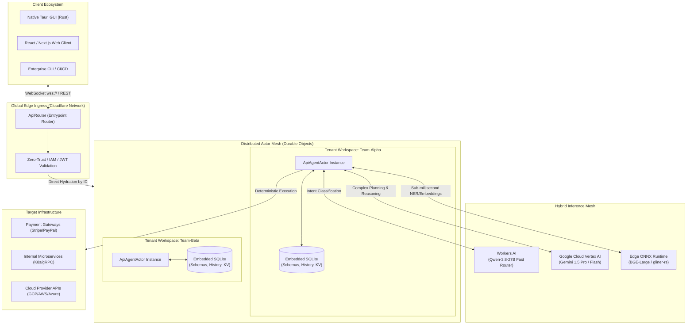
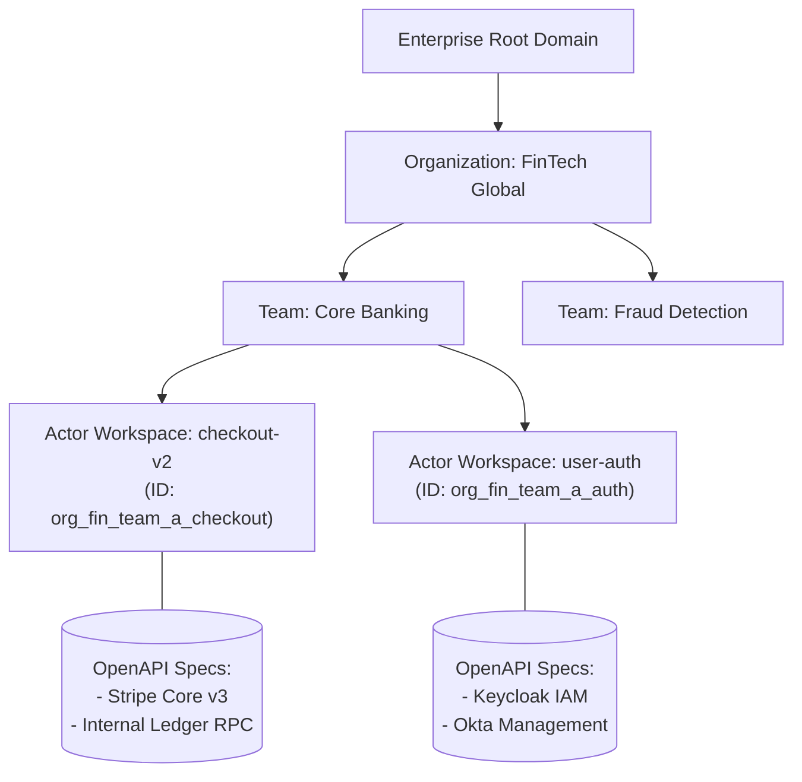
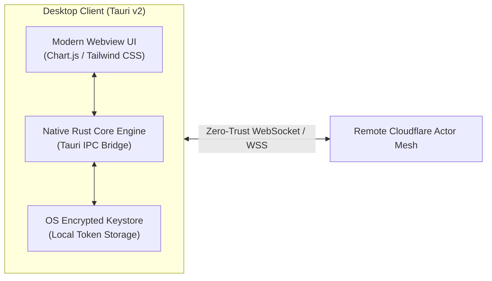

https://api-agent.n8271435.workers.dev/
# 🌐 NexusAgent: Enterprise Distributed Agentic API Mesh

[-F38020?style=for-the-badge&logo=cloudflare)](https://developers.cloudflare.com/durable-objects/)
[](https://cloud.google.com/vertex-ai)
[](https://tauri.app/)
[](https://www.sqlite.org/)
[](https://www.terraform.io/)

**NexusAgent** is an enterprise-grade, distributed agent mesh engineered for automated API orchestration, real-time schema intelligence, and deterministic execution. Built on the **Actor Model** using Cloudflare Durable Objects, it gives each user, team, or workspace an isolated, stateful compute sandbox with ACID-compliant SQLite storage at the edge.

NexusAgent eliminates fragile Python-based scripting architectures. It delivers low-latency schema matching, payload auto-generation, and multi-model failover across **Google Gemini Enterprise**, **Cloudflare Workers AI**, and **custom ONNX runtimes**.

---

## 🏛️ High-Level System Architecture



---

## ⚡ Key Architectural Differentiators

### 1. The Actor Model vs. Stateless Lambdas
Traditional agent frameworks (e.g., standard LangChain/CrewAI Python setups) struggle with race conditions, connection limits, and cold-start state rebuilds. 

NexusAgent uses the **Actor Model** (`@cloudflare/actors`):
* **Stateful Edge Isolation:** Every team, user, or project gets its own Actor ID (`ApiAgentActor.get(actorId)`).
* **Single-Threaded Consistency:** Each Actor processes state modifications sequentially with zero race conditions.
* **Co-located Storage:** SQLite runs directly alongside compute memory, eliminating external database network hops during multi-turn chats.

### 2. Zero-Copy Routing & Semantic Reranking
Instead of passing megabytes of OpenAPI specifications to large context windows on every prompt:
1. Specs are ingested once, parsed into normalized metadata vectors, and indexed into SQLite.
2. Lightweight classifiers route queries across four operational modes: `RERANKER`, `REQGENERATE`, `DATAANALYSIS`, or `CHAT`.
3. High-throughput edge models filter down hundreds of endpoints to the top 3 relevant paths in **< 150ms**.

### 3. Multi-Model Hybrid Fallback Pipeline
* **Tier 1 (Routing & Intent):** Low-cost, fast edge models (`@cf/qwen/qwen3.8-27b`) route queries and extract parameters.
* **Tier 2 (Deep Reasoning & Transformation):** Google Cloud **Gemini 1.5 Pro** builds deeply nested, type-safe API request bodies and analyzes multidimensional response payloads.
* **Tier 3 (Local Edge Inference):** Rust-compiled ONNX models run real-time Named Entity Recognition (NER) to prevent PII and sensitive data leakage.

---

## 👥 Multi-Tenant & Team Workspace Hierarchy



Every workspace is provisioned on demand via query parameters (`?name=workspace-id` or `?id=team-slug`). Actors hibernate when idle (costing zero compute fees) and immediately hydrate with state intact on the next incoming WebSocket connection.

---

## 📡 Protocol & Interface Specifications

### 1. Ingest OpenAPI Specifications (REST)

Ingest public, private, or internal OpenAPI/Swagger specifications directly into the workspace's persistent storage engine.

```bash
curl -X POST "https://api-agent.n8271435.workers.dev/schema?name=team-billing" \
  -H "Content-Type: application/json" \
  -d '{
    "openapi": "3.0.0",
    "info": { "title": "Stripe-Mock API", "version": "2024-06-01" },
    "paths": {
      "/v1/invoices": {
        "get": { "summary": "Retrieve unpaid customer invoices" },
        "post": { "summary": "Create customer payment invoice" }
      }
    }
  }'
```

---

### 2. Real-Time Bidirectional Event Mesh (WebSocket)

Establish an interactive session to execute natural language tasks, query endpoints, and receive streaming telemetry.

```bash
# Connect to the isolated Actor workspace
wscat -c "wss://api-agent.n8271435.workers.dev/?name=team-billing"
```

#### Client Event Payloads

<details open>
<summary><b>A. Natural Language Query (Auto-Classification)</b></summary>

```json
{
  "query": "Find the invoices for customer ID cus_98231 and generate a charge payload"
}
```
*The agent determines intent, routes to `RERANKER`, surfaces `/v1/invoices`, transitions to `REQGENERATE`, and returns the exact parameter tree.*
</details>

<details>
<summary><b>B. Dynamic Upstream Execution & Analysis</b></summary>

```json
{
  "action": "execute_and_analyze",
  "baseUrl": "https://api.stripe.com",
  "operationKey": "POST::/v1/invoices",
  "params": {
    "header": {
      "Authorization": "Bearer sk_test_SAMPLE"
    }
  },
  "body": {
    "customer": "cus_98231",
    "auto_advance": true
  },
  "userQuery": "Verify this invoice payload and highlight anomalies"
}
```
</details>

<details>
<summary><b>C. Dynamic Schema Ingestion via URL</b></summary>

```json
{
  "action": "load_schema",
  "url": "https://api.apis.guru/v2/specs/github.com/1.1.4/openapi.json"
}
```
</details>

---

## 💻 Native Desktop Application (Tauri + Rust)

For low-latency developer environments, NexusAgent includes a cross-platform desktop client powered by **Tauri v2** and **Rust**:

* **Zero-Electron Memory Footprint:** Sub-40MB RAM usage across macOS, Linux, and Windows.
* **Local Keychain Integration:** Hardware-encrypted storage for upstream API keys and team bearer tokens.
* **Offline Schema Indexing:** High-speed tokenization and local validation powered by `ort` (ONNX Runtime in Rust).



---

## 🗄️ Database Schemas (Co-Located SQLite Engine)

Each Actor manages its own SQLite database, maintaining state across restarts through automatic migrations.

```sql
-- Migration Monotonic Inc 1: Foundational Ledger
CREATE TABLE IF NOT EXISTS schema_store (
    id INTEGER PRIMARY KEY, 
    content TEXT,
    metadata TEXT
);

CREATE TABLE IF NOT EXISTS chat_history (
    id INTEGER PRIMARY KEY AUTOINCREMENT, 
    role TEXT CHECK(role IN ('user', 'assistant', 'system')), 
    content TEXT,
    created_at TIMESTAMP DEFAULT CURRENT_TIMESTAMP
);

-- Migration Monotonic Inc 2: Fast Indexing & Team Context
CREATE TABLE IF NOT EXISTS team_credentials (
    provider_id TEXT PRIMARY KEY,
    base_url TEXT NOT NULL,
    auth_header_template TEXT,
    is_active BOOLEAN DEFAULT 1
);
```

---

## 🛠️ Infrastructure as Code (Terraform)

Deploy this architecture to Cloudflare via standard enterprise IaC:

```hcl
terraform {
  required_providers {
    cloudflare = {
      source  = "cloudflare/cloudflare"
      version = "~> 4.0"
    }
  }
}

variable "account_id" {
  type        = string
  description = "Target Cloudflare Account Identifier"
}

resource "cloudflare_workers_script" "api_agent_actor" {
  account_id = var.account_id
  name       = "api-agent-mesh"
  content    = file("${path.module}/dist/index.js")
  module     = true

  durable_object_namespace {
    name       = "API_AGENT_ACTOR"
    class_name = "ApiAgentActor"
  }

  compatibility_date  = "2024-04-01"
  compatibility_flags = ["nodejs_compat"]
}
```

---

## 🚦 Local Development & Deployment

### 1. Clone & Install Dependencies
```bash
git clone https://github.com/YOUR_USER/nexus-api-agent.git
cd nexus-api-agent
npm install
```

### 2. Configure Workers Environment (`wrangler.jsonc`)
```json
{
  "name": "api-agent",
  "main": "src/index.ts",
  "compatibility_date": "2024-04-01",
  "compatibility_flags": ["nodejs_compat"],
  "ai": {
    "binding": "AI"
  },
  "durable_objects": {
    "bindings": [
      {
        "name": "API_AGENT_ACTOR",
        "class_name": "ApiAgentActor"
      }
    ]
  },
  "migrations": [
    {
      "tag": "v1",
      "new_classes": ["ApiAgentActor"]
    }
  ]
}
```

### 3. Run Locally with Live Hot-Reload
```bash
npx wrangler dev
```

### 4. Deploy to the Global Edge Network
```bash
npx wrangler deploy
```

---

## 🗺️ Engineering Roadmap

- [x] Stateful Durable Object Actor clustering with SQLite persistence.
- [x] Multi-format JSON repair algorithm for array and object extraction.
- [x] Intent routing for Reranker, Request Generation, and Data Insights modes.
- [ ] **Google Vertex AI Gemini Connector**: First-class support for Gemini 1.5 Pro tool-calling.
- [ ] **Multi-Agent Consensus (Debate Mode)**: Two distinct Actors validating payloads before executing write operations.
- [ ] **Enterprise Audit Vault**: Streaming export of invocation logs directly to Google Cloud Storage (GCS) and BigQuery.

---

## 📄 License
Distributed under the **MIT License**. Enterprise integrations are certified against OpenAPI v3.0, Cloudflare Workers Runtime, and Google Cloud Platform architectural guidelines.
