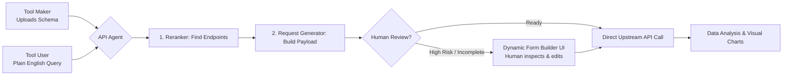

# ⚡ API Agent: Autonomous OpenAPI Mesh & Human-in-the-Loop Explorer

[](https://workers.cloudflare.com/)
[](https://www.sqlite.org/)
[-7B42BC?style=flat-square)](https://developers.cloudflare.com/workers-ai/)
[](https://tailwindcss.com/)
[](https://api-agent.n8271435.workers.dev/)

> **Connecting Tool Makers with Tool Users through living API specs.**  
> API developers write OpenAPI schemas; non-technical teams, product managers, and developers shouldn't have to read through 50-page docs just to run a test call. API Agent turns static OpenAPI files into a conversational partner that handles the tedious parts and lets humans review the critical ones.

---

## 💡 Why This Exists: The Problem We Solved

```
[Tool Makers / Backend Engineers]
       │
       ▼ Writes OpenAPI/Swagger Spec
┌──────────────────────────────┐
│  50+ Endpoints, Complex JSON  │ ──> (Tool Users spend hours reading docs,
└──────────────────────────────┘      figuring out schemas & formatting curl calls)
```

1. **Tool Makers** build powerful backend services and document them with Swagger/OpenAPI.
2. **Tool Users** (testers, frontend devs, internal operations teams) struggle with parameter formats, authentication headers, and multi-step payload construction.
3. **The Bottleneck:** Simple tasks (like *"Find customer #102 and check their order status"*) still require manual lookup, manual form completion, and manual data analysis.

### Our Solution: Automated Execution with Human Oversight



* **Automates the routine:** Endpoint search, parameter resolution, path formatting, and response parsing.
* **Keeps humans in control:** If fields are missing or an action modifies critical data, the AI generates an interactive form for human review before execution.
* **Analyzes the outcome:** Transforms raw JSON responses into plain English summaries and chart visualizers.

---

## 🧠 System Architecture

The project consists of two lightweight components: a stateful **Cloudflare Actor (Durable Object)** and a client-side **Dynamic Form Workspace**.

```mermaid
sequenceDiagram
    autonumber
    actor User as Tool User (Browser)
    participant UI as Dynamic Form Client
    participant Actor as Cloudflare Actor (Agent)
    participant SQLite as Co-Located SQLite
    participant AI as Workers AI (Qwen-27B)
    participant Upstream as External Target API

    User->>UI: Drop OpenAPI Spec (JSON/YAML)
    UI->>Actor: POST /schema OR WS "load_schema"
    Actor->>SQLite: Store Schema & Metadata Cache
    Actor-->>UI: WS { type: "schema_loaded" }

    User->>UI: "Get available pets and show quantities"
    UI->>Actor: WS { query: "Get available pets..." }
    Actor->>AI: Intent Router (RERANKER / REQGENERATE / CHAT)
    AI-->>Actor: Match: GET /pet/findByStatus
    
    Actor->>AI: Build Parameters Payload
    AI-->>Actor: { status: "available" }
    Actor-->>UI: WS { type: "form_fill", preparedRequest }

    User->>UI: Review & Click "Execute"
    UI->>Actor: WS { action: "execute_and_analyze", baseUrl, operationKey }
    Actor->>Upstream: HTTP GET https://petstore.swagger.io/v2/pet/findByStatus?status=available
    Upstream-->>Actor: 200 OK [ {...}, {...} ]
    
    Actor->>AI: Data Analysis Tool
    AI-->>Actor: Summary + HTML Chart Snippet
    Actor-->>UI: WS { type: "data_insights", chart, summary }
    UI-->>User: Displays Formatted Chat + Chart Visual
```

---

## 🗄️ Embedded Database Schemas (SQLite)

The agent runs inside an isolated Cloudflare Actor with zero external database dependencies. State is persisted directly on edge disk using native SQLite migrations:

```sql
-- Migration 1: Core Content Stores
CREATE TABLE IF NOT EXISTS schema_store (
    id INTEGER PRIMARY KEY, 
    content TEXT
);

CREATE TABLE IF NOT EXISTS chat_history (
    id INTEGER PRIMARY KEY AUTOINCREMENT, 
    role TEXT, 
    content TEXT
);

-- Migration 2: Metadata Extraction Optimization
ALTER TABLE schema_store ADD COLUMN metadata TEXT;
```

---

## 🛠️ The 4 Core AI Engines

Built using `@cf/qwen/qwen3.8-27b` on Cloudflare Workers AI:

| Engine | Slash Command | Function | Output |
| :--- | :--- | :--- | :--- |
| **Intent Classifier** | *Auto-detected* | Classifies incoming intent into one of 4 tools | Action String: `reranker`, `reqgenerate`, `dataanalysis`, `chat` |
| **Endpoint Reranker** | `/reranker` | Matches vague user text against hundreds of OpenAPI paths | Ranked top-3 operations with relevance scores |
| **Payload Generator** | `/reqgenerate` | Resolves required parameters, types, and JSON bodies | Formatted JSON ready for manual review or execution |
| **Data Analyst** | `/dataanalysis` | Evaluates API responses and extracts core metrics | Plain-text summary + dynamic HTML/Chart.js iframe snippet |

---

## 🖥️ Client-Side Workspace (`index.html`)

The frontend is a single-file application with zero build steps, using Tailwind CSS, `js-yaml`, and SweetAlert2.

```
┌──────────────────────────────┬──────────────────────────────────────────────┐
│  SIDEBAR: Connection & Specs │  MAIN AREA: Human-in-the-Loop Chat           │
│                              │                                              │
│  - Worker WebSocket URL      │  [User] Find pets with status 'pending'      │
│  - Session Workspace ID      │                                              │
│  - Drag & Drop YAML/JSON     │  [AI] Prepared Request:                      │
│  - Target Base URL (Auto)    │  ┌────────────────────────────────────────┐  │
│  - Manual Endpoint Selector  │  │ GET::/pet/findByStatus                 │  │
│                              │  │ Params: { status: "pending" }          │  │
│  [Open Form Builder]         │  ├────────────────────────────────────────┤  │
│                              │  │ [Edit/Add Files]       [▶ Execute]     │  │
│                              │  └────────────────────────────────────────┘  │
└──────────────────────────────┴──────────────────────────────────────────────┘
```

### Key Client Capabilities
1. **Client-Side Schema Dereferencing:** Resolves complex local and remote `$ref` pointers in nested OpenAPI schemas directly in the browser before dispatching.
2. **Dynamic Modal Form Builder:** Translates OpenAPI JSON Schema definitions into styled inputs:
   * String/Number/Date inputs with validation badges.
   * Enums converted to `<select>` dropdowns.
   * Booleans rendered as interactive toggle switches.
   * Nested objects converted to grouped fieldsets.
   * File and binary fields converted to Base64 payloads over WebSockets.

---

## 🚀 Possible Client-Side UX/UI Improvements

To make this workflow even smoother for non-technical users and teams, here are recommended enhancements for the client:

### 1. Persistent Environment & Auth Profiles
* **Current state:** Users manually input Base URLs; auth headers must be added manually.
* **Improvement:** Add an **Authentication Drawer** where users save reusable profiles (e.g., *Staging API Key*, *Production Bearer Token*, *OAuth2 session*). The client automatically merges these headers into `execute_and_analyze` calls.

### 2. Multi-Schema Workspace Switcher
* **Current state:** Only one schema can be loaded into an Actor instance at a time.
* **Improvement:** Add tabs to manage multiple microservice schemas simultaneously (e.g., `Stripe API`, `Auth Service`, `Inventory Service`), allowing the agent to route queries across multiple backends.

### 3. Visual Workflow Timeline (Step-by-Step Execution Chains)
* **Current state:** Single-step requests (Query → Card → Run).
* **Improvement:** Support multi-step API chains. For example:
  1. `POST /orders` (Generate invoice)
  2. Take generated `order_id`
  3. Run `POST /payments/charge`
  Display this as an interactive visual node graph on the client before execution.

### 4. Interactive Response Inspector
* **Current state:** Displays formatted raw JSON responses in a `<pre>` block.
* **Improvement:** Add an interactive tree view (collapsible JSON nodes) with one-click **"Copy Path"** or **"Send to Chat as Context"** buttons to streamline follow-up queries.

### 5. Safe Mode / Risk Assessment Tags
* **Current state:** All endpoints feature identical execution buttons.
* **Improvement:** Color-code operations based on HTTP method and risk:
  * `GET` (Green - Safe to auto-run)
  * `POST` (Blue - Creates data, review required)
  * `PUT/PATCH` (Yellow - Modifies existing data)
  * `DELETE` (Red - Destructive, requires explicit typing confirmation)

---

## 📦 Getting Started

### 1. Backend (Cloudflare Worker)
```bash
# Clone the repository
git clone https://github.com/YOUR_USERNAME/api-agent.git
cd api-agent

# Install dependencies
npm install

# Start local worker with Actors & AI bindings
npx wrangler dev
```

### 2. Client (Web Interface)
1. Open `index.html` in any web browser.
2. Enter your Worker's address (default local: `ws://localhost:8787` or the live link: `wss://api-agent.n8271435.workers.dev/`).
3. Click **"Load Petstore Sample"** or drop your own OpenAPI specification file (`.json` or `.yaml`).
4. Type plain-English requests into the chat bar. Review generated payloads, open the form builder for manual edits, or run requests with one click.

---

## 🛡️ Human-in-the-Loop Philosophy
This project does **not** treat AI as an unchecked decision-maker. The agent acts as an automated researcher and form-filler: it navigates complex documentation and prepares API requests, but leaves final review, execution confirmation, and sensitive inputs to human operators.
