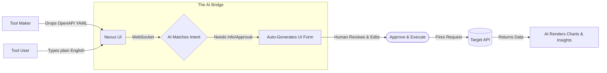

Here is a highly impactful, visually clean, and humanized `README.md` dedicated **strictly to the client-side frontend code** you provided. 

It frames the project exactly as you requested: a bridge between API makers and users, automating the boring stuff while keeping humans explicitly in the loop for execution.

***

  
# 🪄 NexusAgent UI: The AI-to-Human API Bridge

**APIs are built by Tool Makers. But they are needed by Tool Users.** 
This client is a dynamic, AI-driven interface that seamlessly connects the two. 

---

## 🤝 The Vision: Automate the Boring, Approve the Critical

Right now, if an engineering team builds a new internal API, they have to build a custom React dashboard for the operations team to actually use it. **NexusAgent eliminates that step.**

1. **Tool Makers** simply drag and drop their OpenAPI (`.json` or `.yaml`) spec into the UI.
2. **The AI** instantly understands every endpoint, parameter, and requirement.
3. **Tool Users** just type what they want in plain English (*"Add a new pending order for customer 123"*).
4. **The Interface** dynamically generates a beautiful, human-readable form. The AI fills out the boring parts automatically, leaving only the critical fields (or file uploads) for human review.
5. **The Human** clicks "Execute".

This guarantees that **non-critical tasks are automated**, but **destructive or important actions always require explicit human approval.**

---

## 🗺️ How It Works (Visualized)

---

## ✨ Core Client Features

Based on the frontend architecture, this client is designed to be lightweight, fast, and entirely dynamic.

### 🧠 1. Zero-Setup Schema Intelligence
* **Drag-and-Drop:** Drop any Swagger/OpenAPI file into the sidebar.
* **Smart Parsing:** Uses `js-yaml` to parse specs, automatically resolve internal `$ref` pointers, and extract base URLs and environments.
* **Live Target Switching:** The UI dynamically lists all available endpoints for manual selection if you prefer not to chat.

### ⚡ 2. Real-Time WebSocket Streaming
* **Instant Feedback:** Connects to the Cloudflare Worker backend via `wss://`.
* **Stateful Sessions:** Maintains conversation history and dynamically renders interactive UI cards based on AI responses (e.g., "Prepared Request" cards or "API Response" cards).

### 🛠️ 3. Dynamic "Human-in-the-Loop" Form Builder
The most powerful feature of the client. When the AI prepares an API call, the client dynamically renders a strict HTML form based on the OpenAPI schema:
* **Auto-Routing:** Places variables exactly where they belong (`path`, `query`, `header`, or `body`).
* **Type-Safe Inputs:** Automatically renders toggles for `booleans`, dropdowns for `enums`, date-pickers for `dates`, and input fields for `strings`/`numbers`.
* **File Uploads:** Automatically detects `binary` or `multipart/form-data` schemas and renders file dropzones, safely converting files to Base64 for WebSocket transmission.

### 📊 4. AI Data Visualization
When the target API returns raw JSON data, the client doesn't just dump text. It renders a clean UI card containing:
* AI-generated summaries.
* Bulleted insights.
* **Dynamic iframes** rendering Chart.js or Tailwind HTML snippets provided by the AI for instant data visualization.

---

## 🎨 UI / UX Walkthrough

<b>1. Uploading Knowledge</b>

 
The user uploads a schema. The UI parses it, finds the target Base URL, and populates the manual execution dropdown. The AI is now "aware" of your infrastructure.

<b>2. The Conversation</b>

 
The user asks for something complex (e.g., <i>"Create a new pet with an image"</i>). The AI searches the schema and returns a "Prepared Request" card directly in the chat, ready for human review.

<b>3. The Approval Form (Human-in-the-loop)</b>

 
Clicking "Edit/Execute" opens a gorgeous, Tailwind-styled modal. It is completely dynamically generated. The user fills in missing required fields, uploads files, and clicks <b>Execute API Call</b>.

---

## 🚀 Future Client-Side Improvements (Roadmap)

To further streamline operations for enterprise teams, the following UI/UX improvements are planned:

| Category | Planned Improvement | Impact |
| :--- | :--- | :--- |
| **Authentication** | **OAuth2 / OIDC Integration** | Allow the UI to securely hold user bearer tokens, passing them securely in the `headers` of the dynamic forms without manual entry. |
| **File Handling** | **S3 Pre-signed URLs** | Currently, files are converted to Base64 over WebSockets. Upgrading this to upload files directly to an S3 bucket and passing the URL will support massive file uploads (video/audio). |
| **Persistence** | **IndexedDB Local Storage** | Cache uploaded OpenAPI schemas and session histories locally so users don't have to re-upload their team's specs every time they refresh the page. |
| **Collaboration** | **Team Workspaces & Deep Links** | Add URL parameters (e.g., `?workspace=finance&schema=v2`) so a Tool Maker can send a simple link to a Tool User, instantly configuring the UI for their specific task. |
| **UX** | **Dark Mode & Theming** | Implement standard CSS variables to allow enterprise users to match the dashboard to their internal company branding. |

---

## 💻 Getting Started

Because the client is built using vanilla HTML/JS and Tailwind CDN, there is **zero build step** required.

1. Clone the repository.
2. Open `index.html` in any modern web browser.
3. Ensure your Backend Worker URL is pasted into the "Connection Settings" sidebar.
4. Click **Connect to Agent**.
5. Click **Load Petstore Sample** to test the dynamic form generation instantly!
